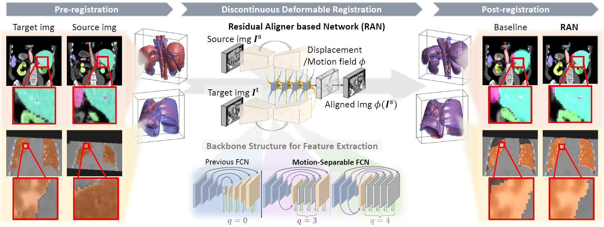

<div align="center">
<h1> Residual Aligner-based Network (RAN) for Coarse-to-fine Discontinuous Deformable Registration </h1>

[](https://doi.org/10.1016/j.media.2023.103038) \| 
[](https://arxiv.org/abs/2203.04290) \|
[]()

</div>

Code for *Medical Image Analysis* paper [Residual Aligner-based Network (RAN): Motion-Aware Structure for Coarse-to-fine Deformable Image Registration](https://doi.org/10.1016/j.media.2023.103038)


> This repo provides an implementation of the training and inference pipeline of RAN based on TensorFlow and Keras. 

---
### Contents ###
- [0. Brief Introduction](#0-brief-intro)
- [1. Installation](#1-installation)
- [2. Usage](#2-usage)
  - [2.1. Training (optional)](#21-training-optional)
  - [2.2. Inference](#22-inference)
- [3. Citing this work](#3-citing-this-work)

---

## 0. Brief Intro ##


<ul style="width: auto; height: 200px; overflow: auto; padding:0.4em; margin:0em; text-align:justify; font-size:small">

The research in this paper focuses on solving the problem of multi-organ discontinuous deformation alignment. An innovative quantitative metric, Motion Separability, is proposed in the paper. This metric is designed to measure the ability of deep learning networks to predict organ discontinuous deformations. Based on this metric, a novel network structure skeleton, the Motion-Separable structure, is designed. In addition, we introduce a Motion disentanglement module to help the network distinguish and process complex motion patterns among different organs.

To verify the validity of this quantitative metric as well as the accuracy and efficiency of our method, a series of unsupervised alignment experiments are conducted in the paper. These experiments cover nine major organs of the abdomen and lung images. The experimental results show that the method in the paper is not only able to effectively identify and process the complex motions among the organs, but also improves the accuracy and efficiency of the alignment.

The main contributions include:
  <li> Discontinuous alignment network: this is the first quantitative study targeting discontinuous deformation alignment based on a deep learning network.
  </li>
  <li> Theoretical analysis: this paper quantifies and defines the maximum range of capturable motion and the upper bound of motion separability in neural networks, providing a theoretical analysis of the upper bound of motion separability. This helps us to understand the range of motion that can be recognised by the network and guides the optimisation of the network structure and parameter settings.   
  </li>
  <li> Motion separable backbone structure: based on the theoretical analysis in this paper, a novel multi-scale skeleton structure is designed in the paper. This structure enables the network to efficiently predict motion patterns with larger separable upper bounds by using optimized dilated convolution on high-resolution feature maps, while maintaining a capturable motion range with low computational complexity.
  </li>
  <li> Motion decoupling and refinement module: in addition, we propose a Residual Aligner module (RAM) that utilizes confidence levels and mechanisms based on semantic and contextual information to differentiate predicted displacements in different organs or regions. This means that our method can more accurately deal with specific movements in each region.
  </li>
  <li> ACCURATE AND EFFICIENT ALIGNMENT RESULTS: The above-proposed components constitute a novel residual alignment network (RAN) that performs efficient, coarse-to-fine, unsupervised alignment of separable motions on publicly available lung and abdominal CT data, achieving higher accuracy and lower computational cost.
  </li>
</ul>

---

## 1. Installation ##

Clone code from Github repo: https://github.com/jianqingzheng/res_aligner_net.git
```shell
git clone https://github.com/jianqingzheng/res_aligner_net.git
cd res_aligner_net/
```
